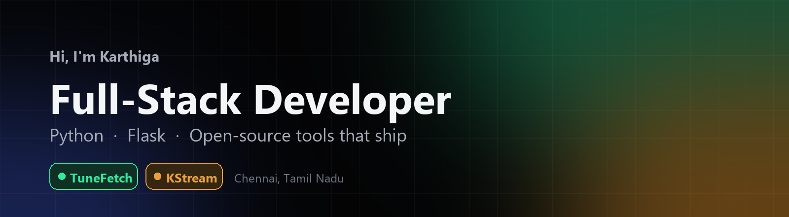
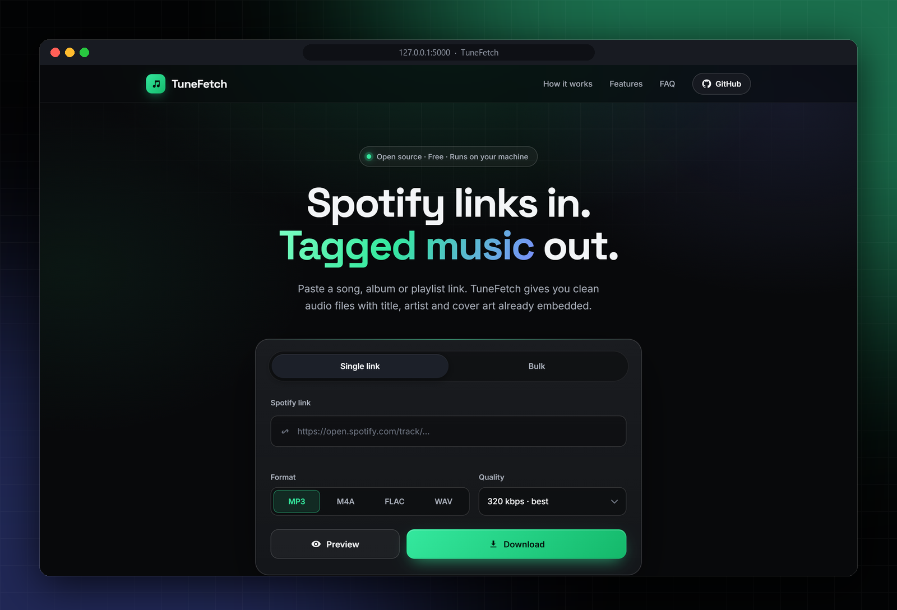
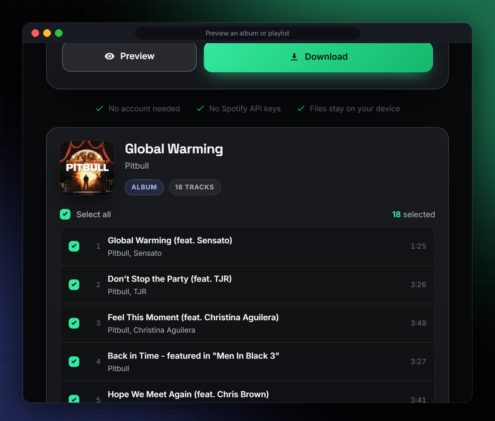
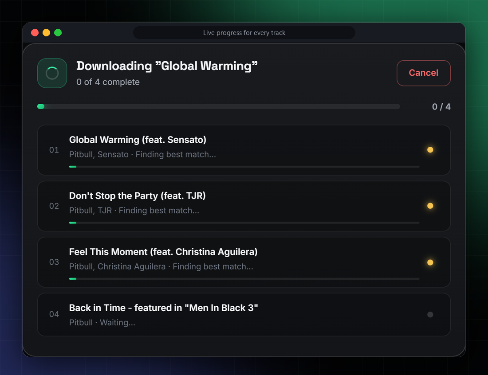
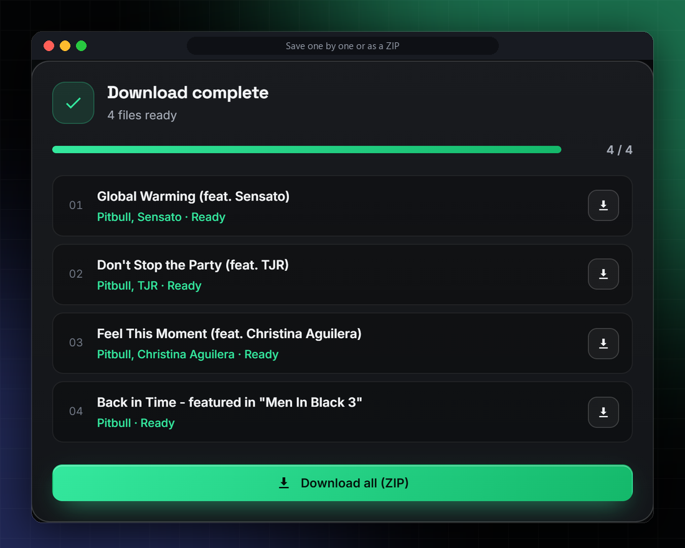
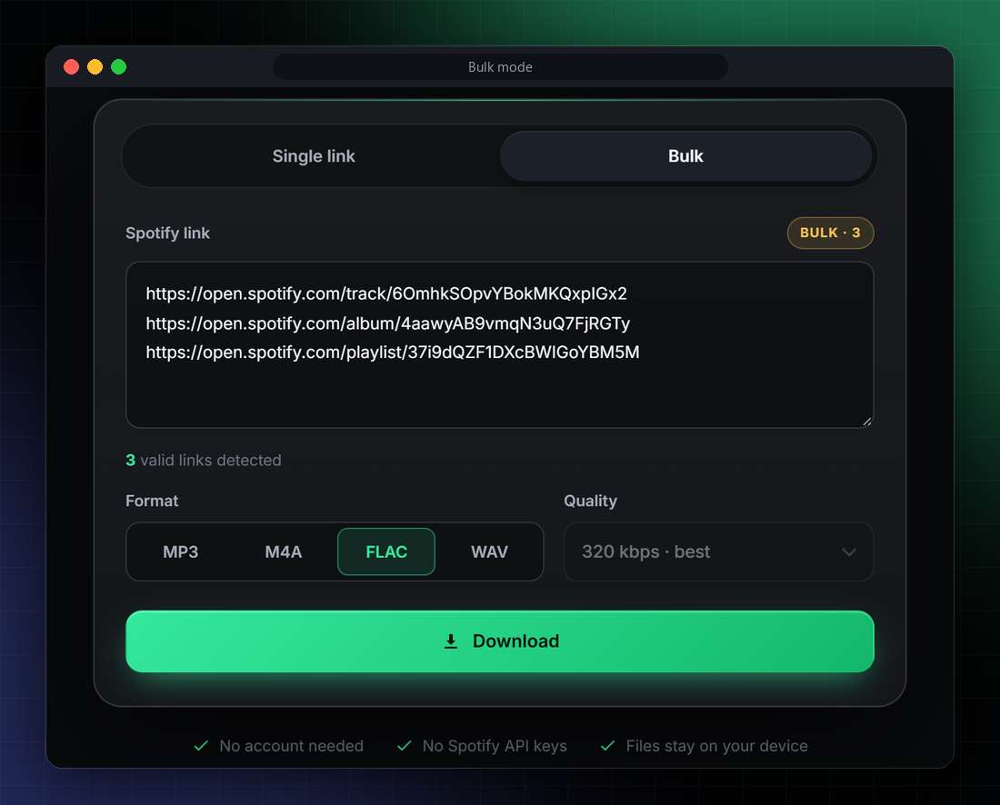
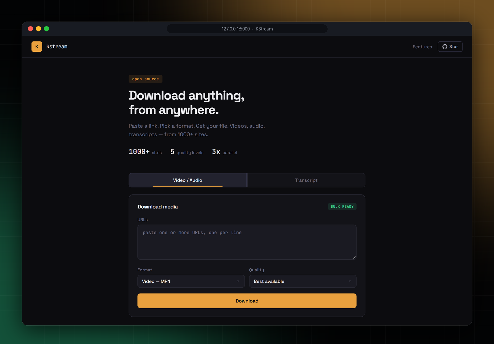
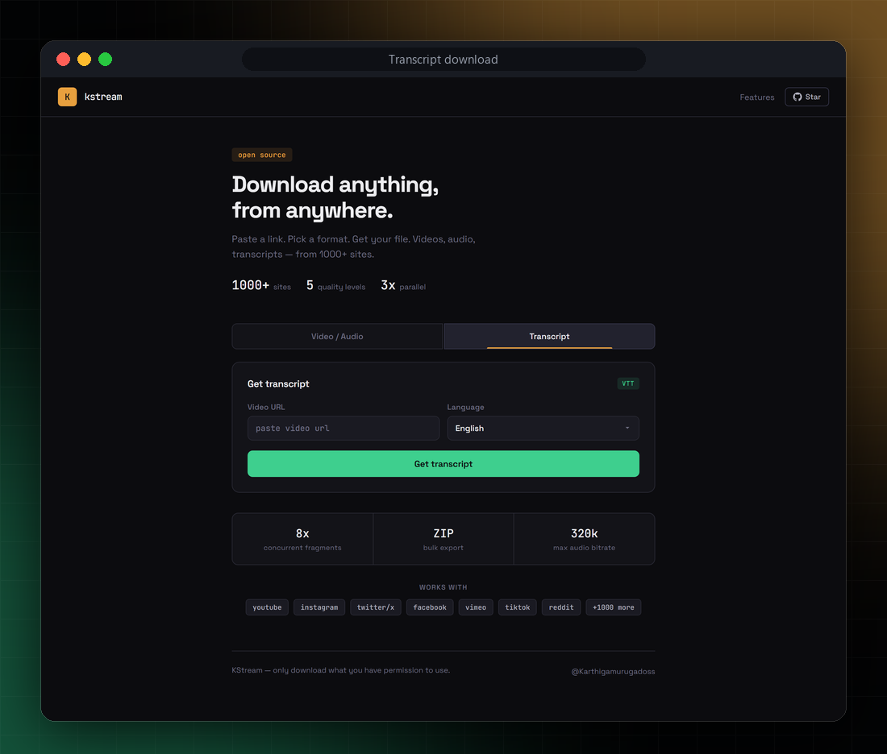
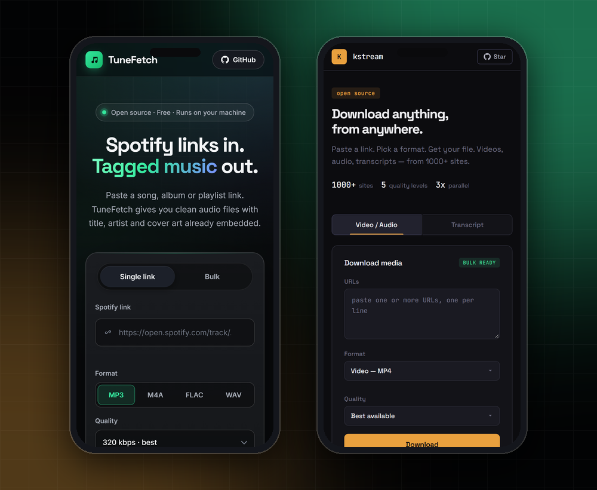

 

<a href="#-featured-projects">Projects</a> &nbsp;·&nbsp;
<a href="#-tunefetch">TuneFetch</a> &nbsp;·&nbsp;
<a href="#-kstream-downloader">KStream</a> &nbsp;·&nbsp;
<a href="#-tech-stack">Tech stack</a> &nbsp;·&nbsp;
<a href="#-github-stats">Stats</a> &nbsp;·&nbsp;
<a href="#-lets-connect">Connect</a>

---

# Hi, I'm Karthiga 👋

I'm a **full-stack software developer from Chennai, Tamil Nadu**. I build tools that solve real problems and ship them as open source, with a focus on **Python backend systems**, **Flask web applications** and **media automation**. Everything I build is self-hosted, free and designed to be production-ready.

> 💼 **Open to collaboration and new opportunities** — especially Python, Flask and full-stack work.

| **2** | **1000+** | **4** | **MIT** |
|:---:|:---:|:---:|:---:|
| open-source apps shipped | sites supported by KStream | audio formats in TuneFetch | open-source licence |

<table>
<tr>
<td width="33%" valign="top">

**⚙️ Backend and APIs** 
Python and Flask services, REST endpoints, concurrent job processing with progress, cancel and retry.

</td>
<td width="33%" valign="top">

**🎞 Media automation** 
Download, convert and tag audio and video with yt-dlp, FFmpeg and mutagen, in bulk and in parallel.

</td>
<td width="33%" valign="top">

**🖥 Polished front ends** 
Responsive HTML, CSS and JavaScript interfaces that feel as good as the code behind them.

</td>
</tr>
</table>

---

## ⭐ Featured projects

---

## 🎵 TuneFetch

**A free, open-source, self-hosted Spotify downloader.** Paste a track, album or playlist link, pick a format, and TuneFetch saves clean audio files with the **title, artist, track number and cover art embedded**. No Spotify account, no Premium and no API keys. Everything runs locally and your files never leave your device.

  

`Python` · `Flask` · `ffmpeg` · `mutagen` · `ytmusicapi`

**[Repository](https://github.com/Karthigamurugadoss/TuneFetch)** &nbsp;·&nbsp; **[Website](https://karthigamurugadoss.github.io/TuneFetch/)** &nbsp;·&nbsp; **[Releases](https://github.com/Karthigamurugadoss/TuneFetch/releases)**

<table>
<tr>
<td width="50%" align="center" valign="top">

<b>Preview</b> an album or playlist and pick your tracks
</td>
<td width="50%" align="center" valign="top">

<b>Live progress</b> for every track, with cancel
</td>
</tr>
<tr>
<td width="50%" align="center" valign="top">

<b>Save</b> tracks one by one or as a single ZIP
</td>
<td width="50%" align="center" valign="top">

<b>Bulk mode</b> for many links at once
</td>
</tr>
</table>

| Feature | Description |
|---|---|
| **Songs, albums, playlists** | Paste any Spotify URL, or queue many links at once in Bulk mode |
| **4 formats** | MP3, M4A, FLAC and WAV, with 128 / 192 / 256 / 320 kbps for MP3 and M4A |
| **Proper tagging** | Title, artist, track number and embedded cover art in every format |
| **Track picker** | Preview a playlist or album and untick what you don't want |
| **Fast and resilient** | 3 parallel downloads, live per-track progress, cancel and retry-failed |

---

## 🎬 KStream Downloader

**A self-hosted web app** that downloads videos, extracts audio as MP3, bulk-exports as ZIP and grabs transcripts, from YouTube, Instagram, Twitter/X and 1000+ websites. No accounts, no limits, no tracking.

  

`Python` · `Flask` · `yt-dlp` · `FFmpeg` · `ThreadPoolExecutor`

**[Repository](https://github.com/Karthigamurugadoss/kstream-downloader)** &nbsp;·&nbsp; **[Website](https://karthigamurugadoss.github.io/kstream-downloader/)** &nbsp;·&nbsp; **[Releases](https://github.com/Karthigamurugadoss/kstream-downloader/releases)**

<table>
<tr>
<td width="50%" align="center">

<b>Transcript download</b> — subtitles in 5 languages
</td>
<td width="50%" valign="middle">

| Feature | Description |
|---|---|
| **Video** | Best, 1080p, 720p, 480p, 360p with automatic audio/video merge |
| **Audio** | MP3 at 320 / 192 / 128 kbps |
| **Bulk** | Many URLs, one ZIP, 3x concurrent downloads |
| **Transcripts** | VTT in English, Tamil, Hindi, Telugu, Malayalam |
| **1000+ sites** | YouTube, Instagram, X, Facebook, TikTok, Reddit and more |

</td>
</tr>
</table>

### 📱 Responsive on every screen

  

TuneFetch (left) and KStream (right) on a phone.

---

## 🛠 Tech stack

| | Area | What I use it for |
|---|---|---|
| 🐍 | **Python** | Backend logic, automation, scripting |
| 🌶 | **Flask** | Web framework, REST APIs, routing |
| 🎥 | **yt-dlp** and **ytmusicapi** | Media extraction and matching |
| 🔊 | **FFmpeg** and **mutagen** | Audio/video conversion and tagging |
| ⚡ | **ThreadPoolExecutor** | Concurrent bulk downloads |
| 🎨 | **HTML / CSS / JS** | Responsive front ends |
| 🗄 | **SQLite / MySQL** | Database layer |
| 🔧 | **Git and GitHub Actions** | Version control and CI/CD |

---

## 📊 GitHub stats

&nbsp;&nbsp;

---

## 🚀 What's next

- **KStream v3** — download progress bars, playlist support and one-command Docker deployment
- **CLI tools** — Python automation scripts for developer workflows
- **More open source** — actively building, and looking for Flask and Python projects to contribute to

---

## 💬 Let's connect

I'm always happy to collaborate on open-source projects, talk backend architecture, or help fellow developers build better tools. If you find my projects useful, a ⭐ goes a long way.

 

  
Built with focus, shipped with intent.

