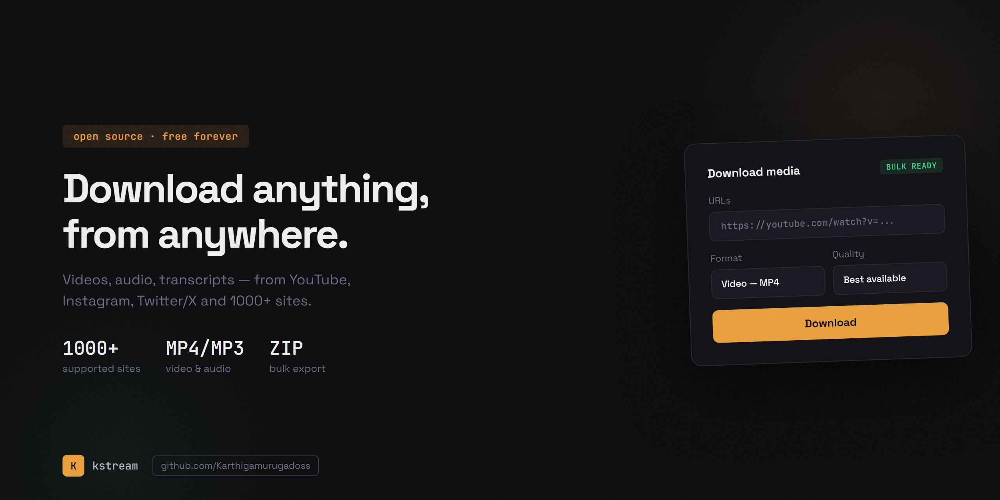
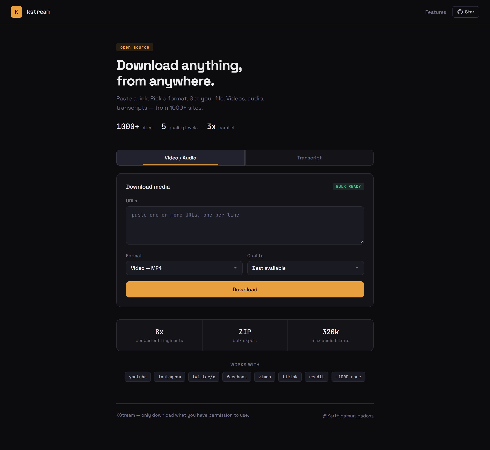
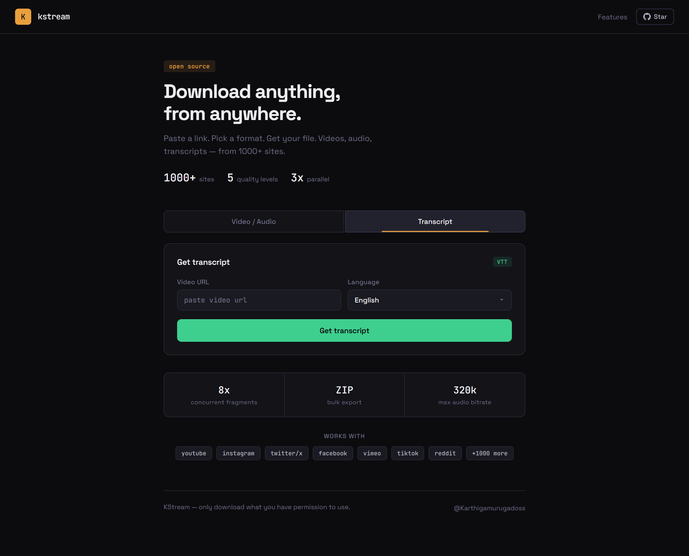
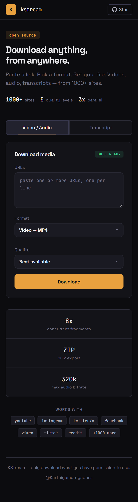

 

---

# Karthiga — Full-Stack Developer & Open-Source Builder

I'm a software developer from **Chennai, Tamil Nadu** who builds tools that solve real problems and ships them as open source. I focus on **Python backend systems**, **Flask web applications**, and **media automation** — everything I build is designed to be self-hosted, free, and production-ready.

**1000+ supported sites** · **Video, Audio & Transcripts** · **Bulk ZIP exports** · **MIT licensed** · designed, coded and shipped by one person.

**[KStream Downloader](#-kstream-downloader)** · **[Tech Stack](#-tech-stack)** · **[GitHub Stats](#-github-stats)** · **[Roadmap](#-whats-next)** · **[Connect](#-lets-connect)**

---

## 🎬 KStream Downloader

**My flagship open-source project.** A self-hosted web app that downloads videos, extracts audio as MP3, bulk-exports as ZIP, and grabs transcripts — from YouTube, Instagram, Twitter/X, and 1000+ websites. No accounts, no limits, no tracking.

`Python` · `Flask` · `yt-dlp` · `FFmpeg` · `ThreadPoolExecutor` · `Responsive UI`

<table>
<tr>
<td width="50%">

 <b>Video & Audio Download</b> — select format, quality, and hit download.
</td>
<td width="50%">

 <b>Transcript Download</b> — grab subtitles in 5 languages.
</td>
</tr>
</table>

<strong>📱 Mobile View</strong>

 

Fully responsive — works on any screen size.

### Key Features

| Feature | Description |
|---|---|
| **Video Download** | Best, 1080p, 720p, 480p, 360p — automatic audio/video merge via FFmpeg |
| **Audio Extraction** | MP3 at 320 / 192 / 128 kbps — studio to standard quality |
| **Bulk Download** | Paste multiple URLs → get a single ZIP with 3x concurrent downloads |
| **Transcripts** | VTT subtitles in English, Tamil, Hindi, Telugu, Malayalam |
| **1000+ Sites** | YouTube, Instagram, Twitter/X, Facebook, TikTok, Reddit, and more |

---

## 🛠 Tech Stack

| | Technology | Use |
|---|---|---|
| 🐍 | **Python** | Backend logic, automation, scripting |
| 🌶 | **Flask** | Web framework, REST APIs, routing |
| 🎥 | **yt-dlp** | Media extraction engine — 1000+ sites |
| 🔊 | **FFmpeg** | Audio/video processing and conversion |
| ⚡ | **ThreadPoolExecutor** | Concurrent bulk downloads |
| 🎨 | **HTML/CSS/JS** | Responsive frontend, Space Grotesk + JetBrains Mono |
| 🗄 | **SQLite / MySQL** | Database layer |
| 🔧 | **Git & GitHub Actions** | Version control and CI/CD |

---

## 📊 GitHub Stats

&nbsp;&nbsp;

  

---

## 🚀 What's Next

- **KStream v3** — download progress bars, playlist support, Docker one-command deployment
- **CLI Tools** — Python automation scripts for developer workflows
- **More open source** — actively building and looking for Flask/Python projects to contribute to

---

## 💬 Let's Connect

I'm always open to collaborating on open-source projects, discussing backend architecture, or helping fellow developers build better tools.

---

  
Built with focus, shipped with intent.

